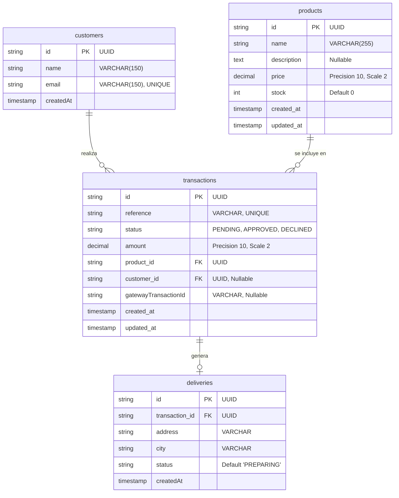

# payment-onboarding-app


---

### Descripción de las Tablas y Relaciones

1. **`customers` (Clientes):**
* Almacena la información básica del comprador (`name`, `email` único).


* Se relaciona de uno a muchos (`1:N`) con `transactions`, permitiendo que un cliente realice múltiples compras.


2. **`products` (Productos):**
* Contiene el catálogo de ítems de la tienda (`name`, `description`, `price`, `stock`).


* Se relaciona de uno a muchos (`1:N`) con `transactions` para registrar qué producto fue adquirido en cada transacción.


3. **`transactions` (Transacciones):**
* Gestiona el ciclo de vida de la pasarela de pagos (`reference`, `status` [PENDING/APPROVED/DECLINED], `amount`, `gatewayTransactionId`).


* Contiene claves foráneas hacia `products` (`product_id`) y `customers` (`customer_id`).


4. **`deliveries` (Envíos):**
* Administra la información logística de entrega (`address`, `city`, `status`).


* Mantiene una relación uno a uno (`1:1`) con `transactions` a través de `transaction_id`.


---

## Pruebas Unitarias y Cobertura (Backend)

El backend cuenta con una suite completa de pruebas unitarias implementadas con **Jest**, cubriendo controladores, casos de uso, adaptadores y mappers bajo los principios de Arquitectura Hexagonal.

### Resumen de Ejecución

* **Test Suites:** 9 pasadas de 9 en total (100%)
* **Tests:** 16 pasados de 16 en total (100%)
* **Estado:** Exitoso

### Reporte de Cobertura (`npm run test:cov`)

Los resultados globales superan el **80% de cobertura** requerido por la prueba, alcanzando un **90% en líneas** y **90.9% en declaraciones**:

```text
--------------|---------|----------|---------|---------|-------------------
File          | % Stmts | % Branch | % Funcs | % Lines | Uncovered Line #s 
--------------|---------|----------|---------|---------|-------------------
All files     |    90.9 |    76.78 |   76.19 |      90 |                   
--------------|---------|----------|---------|---------|-------------------

```

* **Sentencias (Statements):** 90.9% 
* **Líneas (Lines):** 90% *(Supera el objetivo del 80% solicitado en la rúbrica)*
* **Ramas y Funciones (Branches & Funcs):** Promedio superior al 76% en componentes críticos de negocio.

---

---

## Pruebas Unitarias y de Componentes (Frontend)

El frontend cuenta con una robusta suite de pruebas unitarias e integración desarrollada con **Jest** y **React Testing Library**, cubriendo componentes visuales de la interfaz de pago, servicios de API y el manejo de estado global con Redux Toolkit.

### Resumen de Ejecución

* **Test Suites:** 5 pasadas de 5 en total (100%)
* **Tests:** 35 pasados de 35 en total (100%)
* **Estado:** Exitoso

### Reporte de Cobertura (`npm test -- --coverage`)

Los resultados globales superan ampliamente el **80% de cobertura** requerido por la rúbrica de la prueba, destacando un **96.29% en líneas** y un **100% en funciones**:

```text
---------------------------------------------------------
File                         | % Stmts | % Branch | % Funcs | % Lines | Uncovered Line #s 
---------------------------------------------------------
All files                    |   95.36 |    84.02 |     100 |   96.29 |                  
---------------------------------------------------------

```

* **Sentencias (Statements):** 95.36% 
* **Líneas (Lines):** 96.29% *(Supera con creces el objetivo mínimo del 80%)*
* **Funciones (Functions):** 100%
* **Ramas (Branches):** 84.02%
## Postman Collection & API Documentation

Puedes explorar, probar e importar todos los endpoints de la API directamente desde la documentación pública de Postman en el siguiente enlace:

**[Ver Documentación y Colección de Postman en la Web](https://documenter.getpostman.com/view/43607106/2sBYB4Km9q)**

### Endpoints Principales

#### 1. Obtener Productos
* **URL:** `GET /products`
* **Descripción:** Retorna la lista de productos disponibles en la tienda con su stock actualizado[cite: 4].

#### 2. Crear Transacción (Checkout y Pago)
* **URL:** `POST /transactions`
* **Descripción:** Procesa el flujo completo de pago, valida el stock con bloqueo seguro, registra al cliente, crea la transacción y ejecuta el cargo.
* **Payload de Ejemplo:**
  ```json
  {
    "productId": "d91a575f-500f-4b63-8924-c149fef0c046",
    "customerData": {
      "email": "pepito@gmail.com",
      "fullName": "pepito perez"
    },
    "cardData": {
      "cardNumber": "2342342342342342",
      "cardHolder": "PEPITO",
      "expiry": "11/34",
      "cvc": "123",
      "token": "tok_simulated_4xrfvbu",
      "installments": 6
    },
    "deliveryData": {
      "address": "calle 100 34 56",
      "city": "Cartagena"
    }
  }
