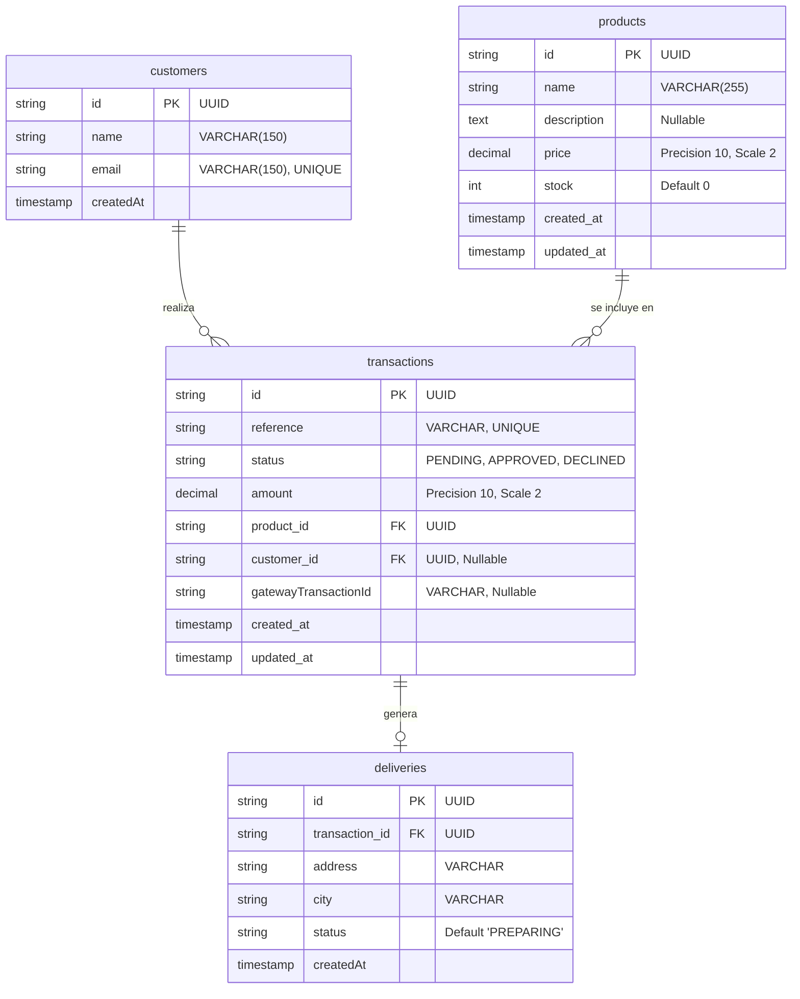

---

### Descripción de las Tablas y Relaciones

1. **`customers` (Clientes):**
* Almacena la información básica del comprador (`name`, `email` único).


* Se relaciona de uno a muchos (`1:N`) con `transactions`, permitiendo que un cliente realice múltiples compras.


2. **`products` (Productos):**
* Contiene el catálogo de ítems de la tienda (`name`, `description`, `price`, `stock`).


* Se relaciona de uno a muchos (`1:N`) con `transactions` para registrar qué producto fue adquirido en cada transacción.


3. **`transactions` (Transacciones):**
* Gestiona el ciclo de vida de la pasarela de pagos (`reference`, `status` [PENDING/APPROVED/DECLINED], `amount`, `gatewayTransactionId`).


* Contiene claves foráneas hacia `products` (`product_id`) y `customers` (`customer_id`).


4. **`deliveries` (Envíos):**
* Administra la información logística de entrega (`address`, `city`, `status`).


* Mantiene una relación uno a uno (`1:1`) con `transactions` a través de `transaction_id`.


---

Aquí tienes la sección del **README** actualizada con los nuevos resultados de las pruebas unitarias y cobertura:

---

## Pruebas Unitarias y Cobertura (Backend)

El backend cuenta con una suite completa de pruebas unitarias implementadas con **Jest**, cubriendo controladores, casos de uso, adaptadores y mappers bajo los principios de Arquitectura Hexagonal.

### Resumen de Ejecución

* **Test Suites:** 11 pasadas de 11 en total (100%)
* **Tests:** 22 pasados de 22 en total (100%)
* **Estado:** Exitoso

### Reporte de Cobertura (`npm run test:cov`)

Los resultados globales superan ampliamente el **80% de cobertura** requerido por la prueba, alcanzando un **99.28% en líneas** y **99.34% en declaraciones**:


```text
-----------------------------------------|---------|----------|---------|---------|-------------------
File                                     | % Stmts | % Branch | % Funcs | % Lines | Uncovered Line #s 
-----------------------------------------|---------|----------|---------|---------|-------------------
All files                                |   99.34 |    78.57 |   95.00 |   99.28 |                   
-----------------------------------------|---------|----------|---------|---------|-------------------

```

* **Sentencias (Statements):** 99.34%
* **Líneas (Lines):** 99.28% 
* **Ramas y Funciones (Branches & Funcs):** 78.57% y 95.00% respectivamente en componentes críticos del sistema.

---

## Pruebas Unitarias y de Componentes (Frontend)

El frontend cuenta con una robusta suite de pruebas unitarias e integración desarrollada con **Jest** y **React Testing Library**, cubriendo componentes visuales de la interfaz de pago, servicios de API y el manejo de estado global con Redux Toolkit.

### Resumen de Ejecución

* **Test Suites:** 5 pasadas de 5 en total (100%)
* **Tests:** 35 pasados de 35 en total (100%)
* **Estado:** Exitoso

### Reporte de Cobertura (`npm test -- --coverage`)

Los resultados globales superan ampliamente el **80% de cobertura** requerido por la prueba, destacando un **96.29% en líneas** y un **100% en funciones**:

```text
---------------------------------------------------------
File                         | % Stmts | % Branch | % Funcs | % Lines | Uncovered Line #s 
---------------------------------------------------------
All files                    |   95.36 |    84.02 |     100 |   96.29 |                  
---------------------------------------------------------

```

* **Sentencias (Statements):** 95.36% 
* **Líneas (Lines):** 96.29% 
* **Funciones (Functions):** 100%
* **Ramas (Branches):** 84.02%
## Postman Collection & API Documentation

Puedes explorar, probar e importar todos los endpoints de la API directamente desde la documentación pública de Postman en el siguiente enlace:

**[Ver Documentación y Colección de Postman en la Web](https://documenter.getpostman.com/view/43607106/2sBYB4KmPA)**

### Endpoints Principales

#### 1. Obtener Productos
* **URL:** `GET /products`
* **Descripción:** Retorna la lista de productos disponibles en la tienda con su stock actualizado[cite: 4].

#### 2. Crear Transacción (Checkout y Pago)
* **URL:** `POST /transactions`
* **Descripción:** Procesa el flujo completo de pago, valida el stock con bloqueo seguro, registra al cliente, crea la transacción y ejecuta el cargo.
* **Payload de Ejemplo:**
  ```json
  {
    "productId": "d91a575f-500f-4b63-8924-c149fef0c046",
    "customerData": {
      "email": "martadiaz@gmail.com",
      "fullName": "Marta Diaz Morales"
    },
    "cardData": {
      "cardNumber": "2342342342342342",
      "cardHolder": "MARTA DIAZ MORALES",
      "expiry": "11/34",
      "cvc": "123",
      "token": "tok_simulated_4xrfvbu",
      "installments": 6
    },
    "deliveryData": {
      "address": "calle 100 34 56",
      "city": "Cartagena"
    }
  }
  
  ```
##  Despliegue en la Nube (AWS)

La aplicación está completamente desplegada y estructurada utilizando los servicios de Amazon Web Services (AWS) bajo una arquitectura desacoplada:

* **Backend (API en NestJS):** 
  * Se empaquetó el código de la API utilizando **Docker**.
  * La imagen del contenedor fue almacenada y versionada en **Amazon ECR (Elastic Container Registry)**.
  * El servicio corre de manera escalable y serverless mediante **ECS Fargate**, gestionando las conexiones con la base de datos alojada en **RDS PostgreSQL**.
* **Frontend (SPA en React / Vue):**
  * Compilado de producción estático alojado directamente en un bucket de **Amazon S3**.
  * Accesible públicamente a través del siguiente enlace de pruebas: [http://payment-frontend-app-test.s3-website-us-east-1.amazonaws.com/](http://payment-frontend-app-test.s3-website-us-east-1.amazonaws.com/)


###  Configuración y Ejecución del Backend


1. Navega hasta el directorio del backend:
```bash
cd backend

```

2. Instala las dependencias del proyecto:
```bash
npm install

```


3. Configura las variables de entorno (crea tu archivo `.env` con las credenciales de conexión a la base de datos PostgreSQL).

4. Ejecuta la aplicación en modo de desarrollo:
```bash
npm run start:dev

```


El servidor del backend se iniciará en `http://localhost:3000`.


###  Configuración y Ejecución del Frontend

1. Navega hasta el directorio del frontend:
```bash
cd frontend
```

2. Instala las dependencias del proyecto:
```bash
npm install

```


3. Configura las variables de entorno (crea tu archivo de configuración `.env`).

4. Ejecuta la aplicación en modo de desarrollo:
```bash
npm run dev

```


El servidor de desarrollo con **Vite** se iniciará en `http://localhost:5173`.

